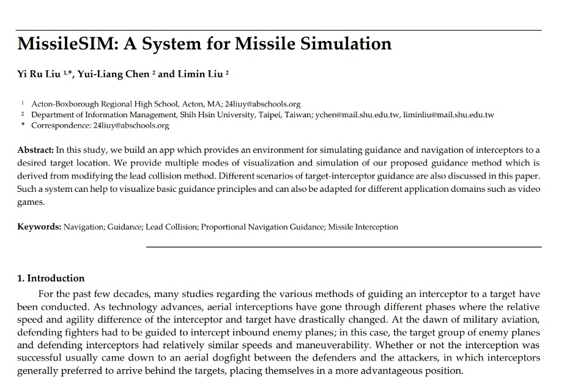
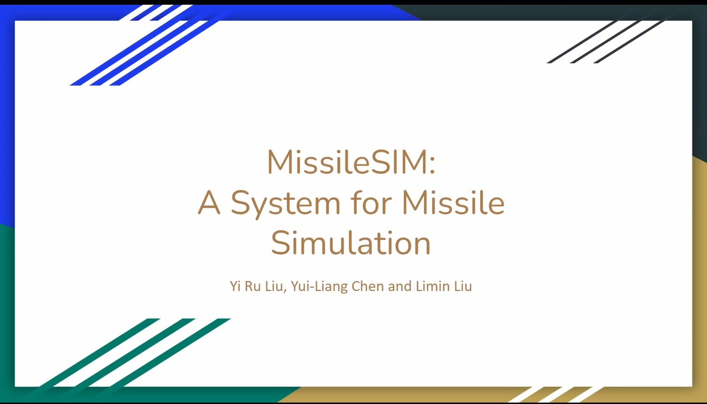
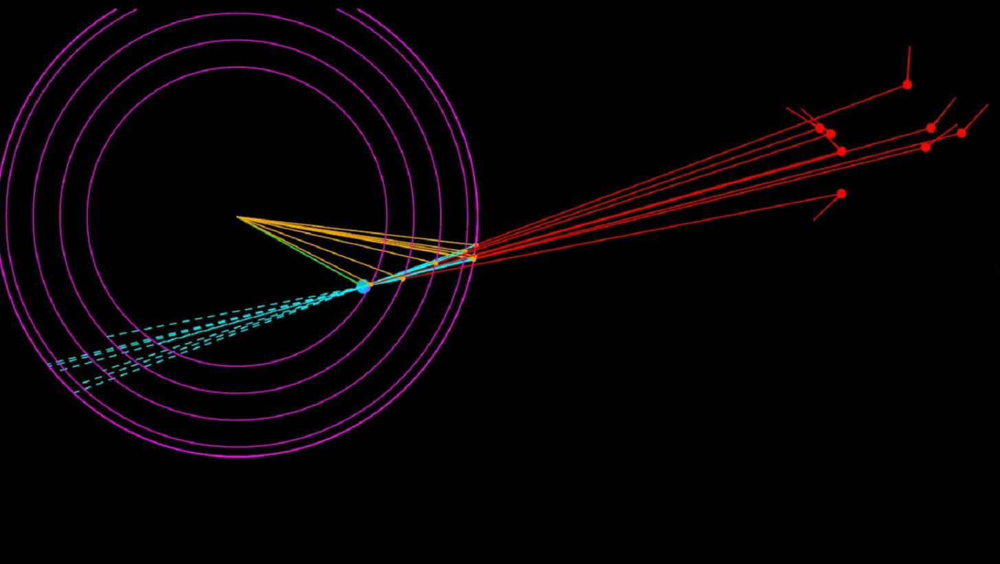
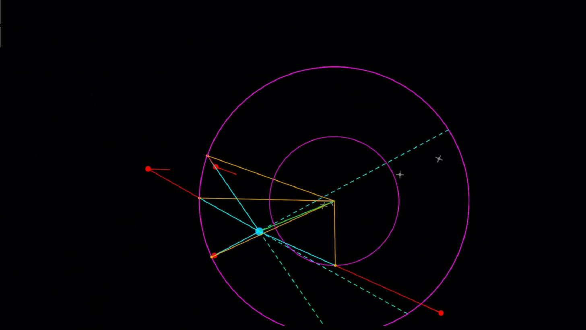
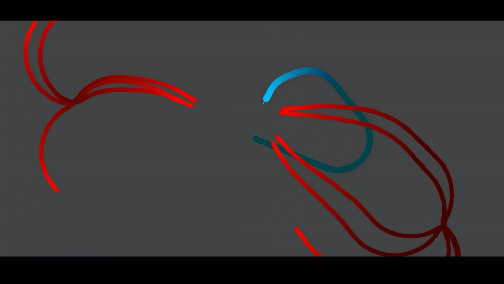
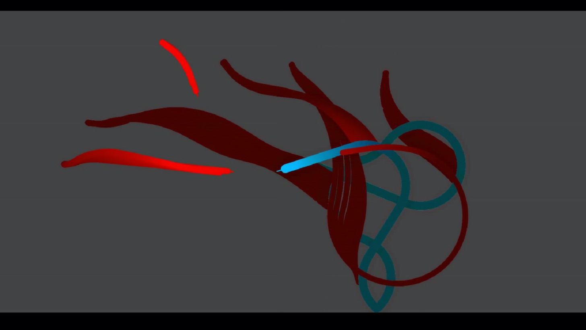

# ICNIIA_2023

I attend the International Conference on Next-generation Intelligent Information Applocations (ICNIIA) at Feb. 2, 2023 and published a full conference paper titled: MissileSIM: A System for Missile Simulation.

## Conference Webpage
[ICNIIA 2023](https://sites.google.com/mail.shu.edu.tw/shu-im-2023/%E9%A6%96%E9%A0%81?authuser=0)

## Full paper (Click to download the full paper)

# Presentation (Click to see my presentation)

## Demo in actions (Click images to see demos)

|| |
|-|-|
|| |
|| |

## Conference Agenda
[Schedule](https://drive.google.com/file/d/1aUVv7goLzrCyancm6GE-RPX--ToFqC4s/view)

## Conference proceedings
[E-proceedings](https://sites.google.com/mail.shu.edu.tw/shu-im-2023/%E8%AB%96%E6%96%87%E9%9B%86)
