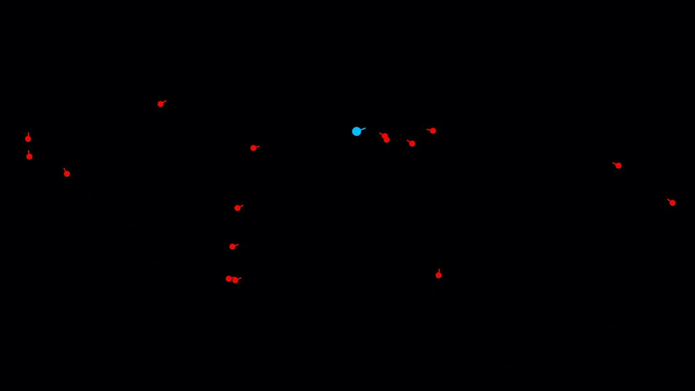
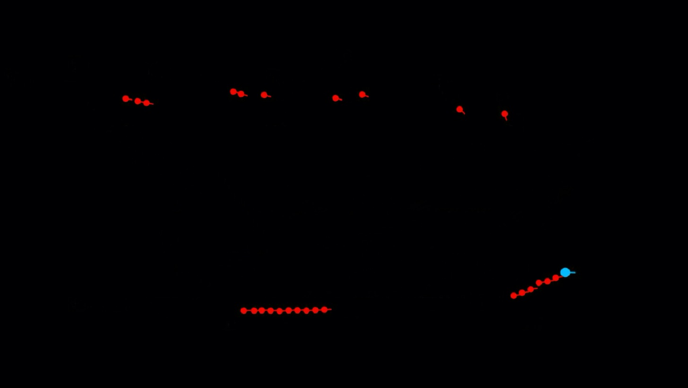

# ICNIIA_2023

I attended the International Conference on Next-generation Intelligent Information Applocations [ICNIIA 2023](https://sites.google.com/mail.shu.edu.tw/shu-im-2023/%E9%A6%96%E9%A0%81?authuser=0) on February 2, 2023 and presented a full conference paper titled:  
**MissileSIM: A System for Missile Simulation**

Here are the [Conference Schedule](https://drive.google.com/file/d/1aUVv7goLzrCyancm6GE-RPX--ToFqC4s/view) and the [Conference Proceedings](https://sites.google.com/mail.shu.edu.tw/shu-im-2023/%E8%AB%96%E6%96%87%E9%9B%86).

## [Full Paper](supp/MisSIM.pdf)

# Presentation

## Video Demonstrations (click to see video)

|| |
|-|-|
|| |
|| |
